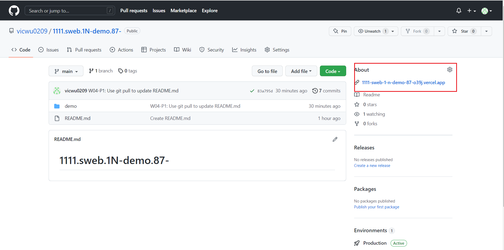
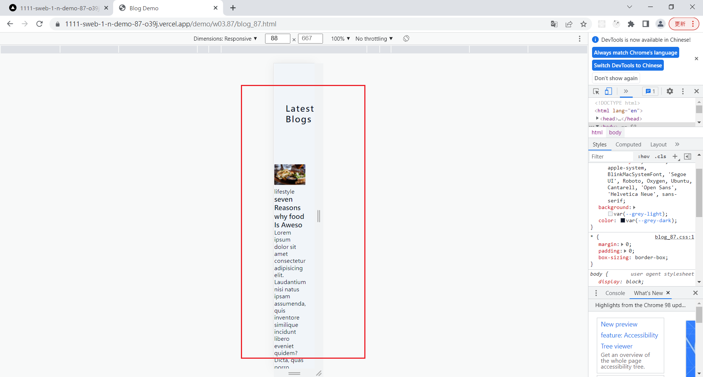
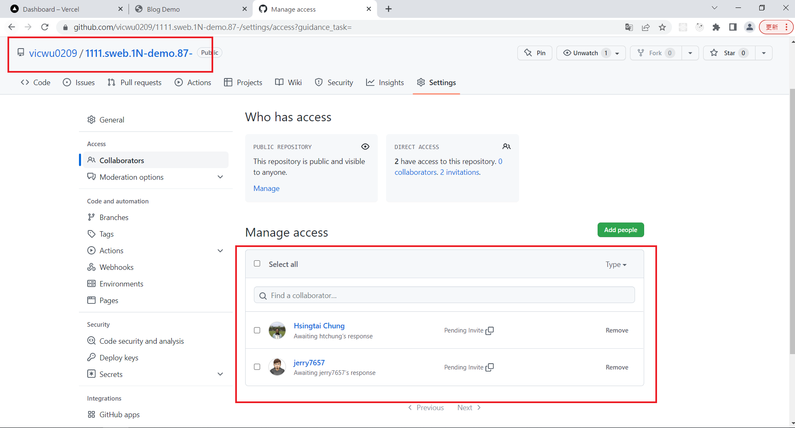
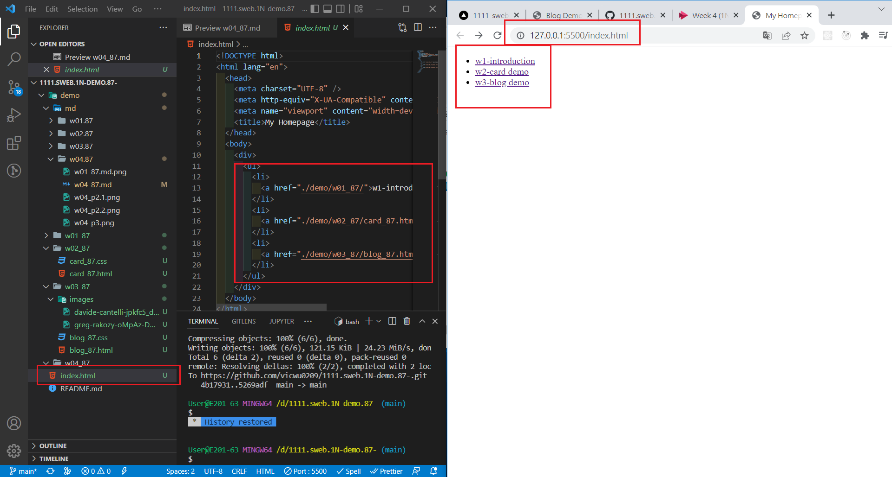
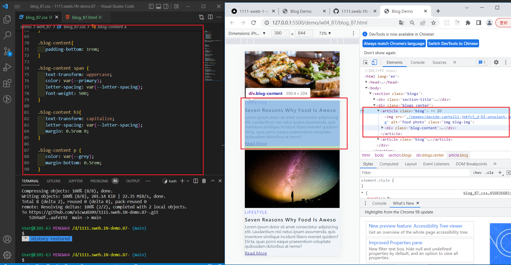

### W04-P1: Use git pull to update README.md

### W04-P2: Deploy Github to Vercel

### W04-P3: Share Github repo to teacher and TA

### W04-P4: add index.html as homepage, and show in Vercel

### W05-P5: finish w03 blog demo with hover and transition

