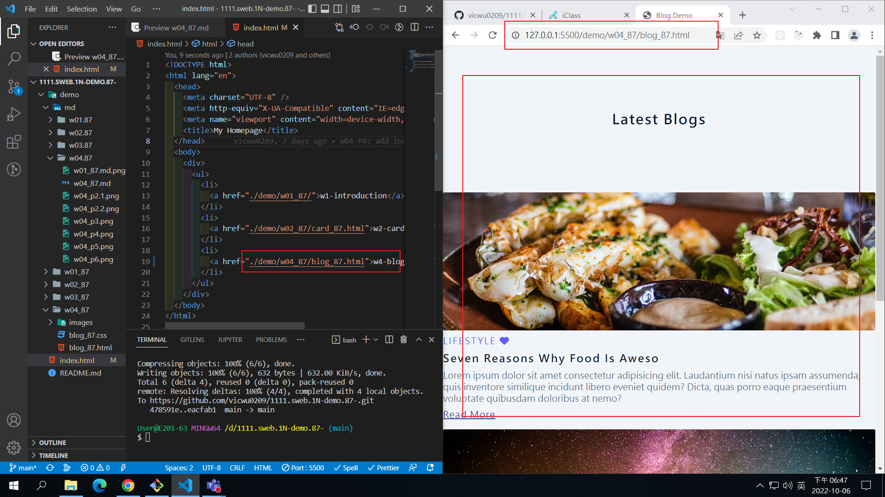

### Github repo ur1

[My Github repo](https://github.com/vicwu0209/1111.sweb.1N-demo.87-.git)

### W05-P1: add w04 link in index.html

### W05-logs: W4 all logs

$ git log --pretty=format:"%h%x09%an%x09%ad%x09%s" --after="2022-10-05"
