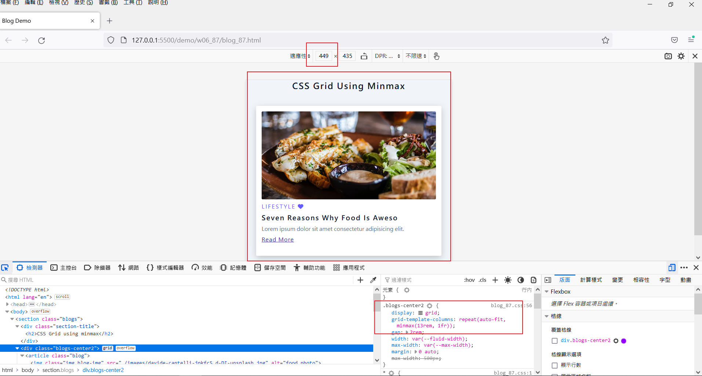
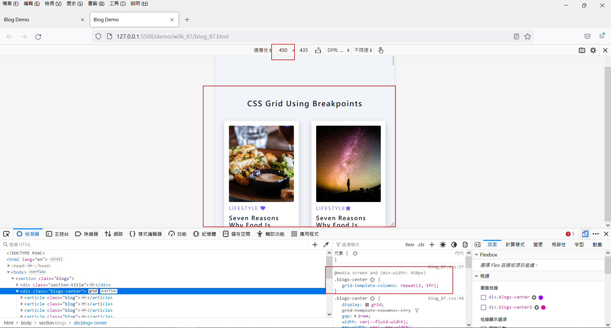
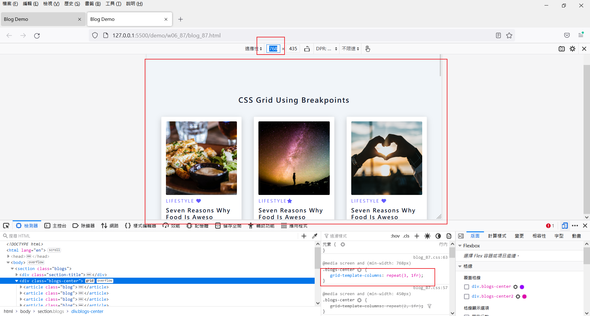
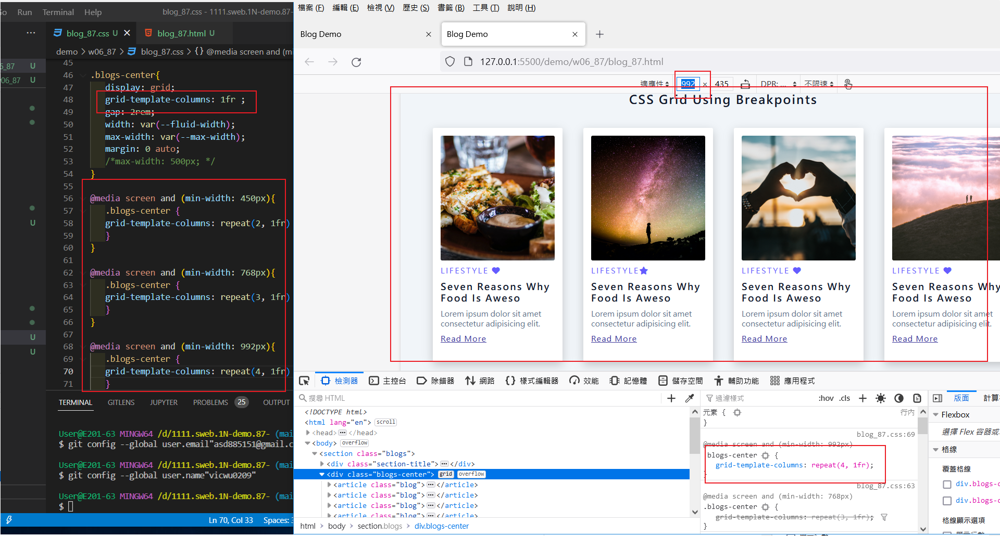
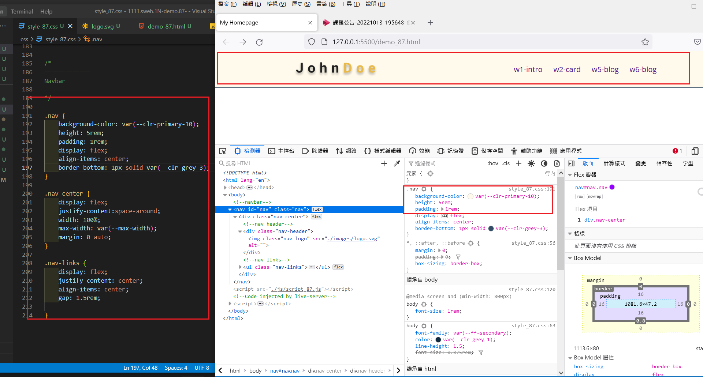
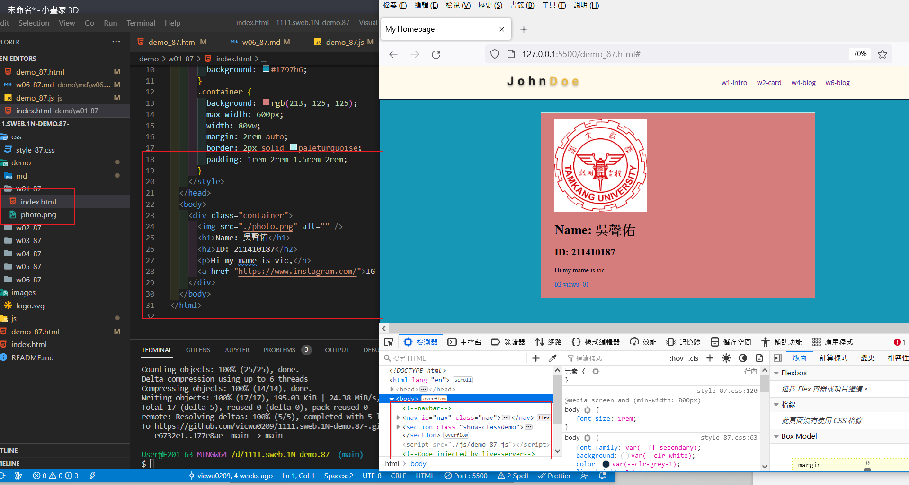
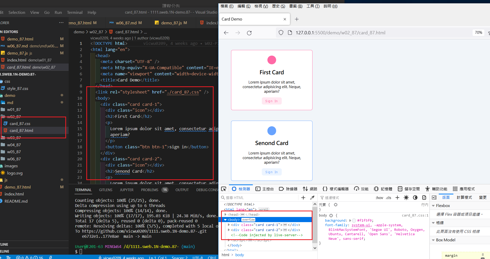
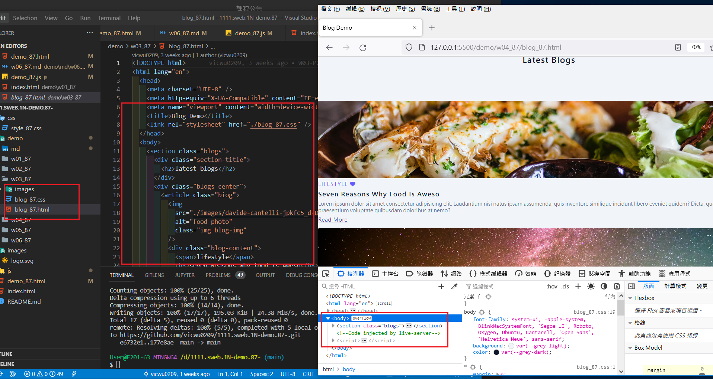
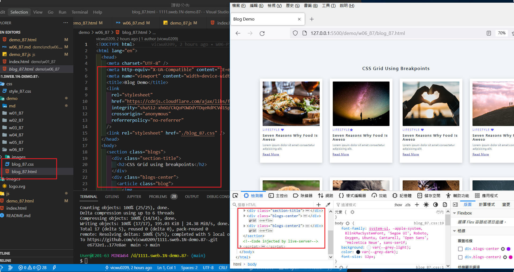
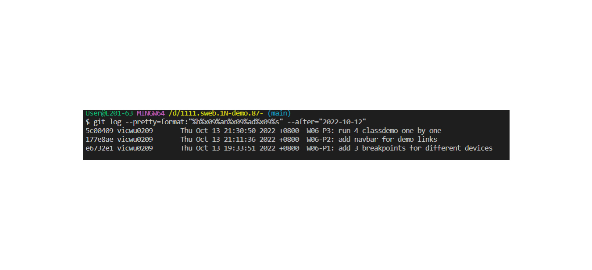

### Github repo ur1

[My Github repo](https://github.com/vicwu0209/1111.sweb.1N-demo.87-.git)

### W06-P1: add 3 breakpoints for different devices

### W06-P2: add navbar for demo links

### W06-P3: run 4 classdemo one by one

### W06-logs: W4 all logs

$ git log --pretty=format:"%h%x09%an%x09%ad%x09%s" --after="2022-10-12"
5c00409 vicwu0209 Thu Oct 13 21:30:50 2022 +0800 W06-P3: run 4 classdemo one by one
177e8ae vicwu0209 Thu Oct 13 21:11:36 2022 +0800 W06-P2: add navbar for demo links
e6732e1 vicwu0209 Thu Oct 13 19:33:51 2022 +0800 W06-P1: add 3 breakpoints for different devices
