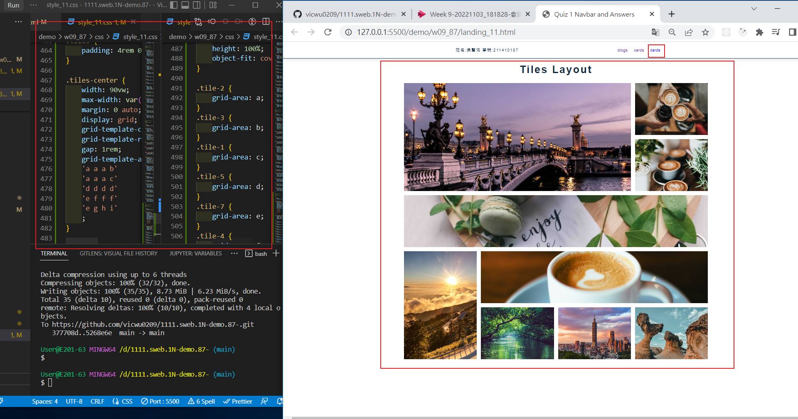
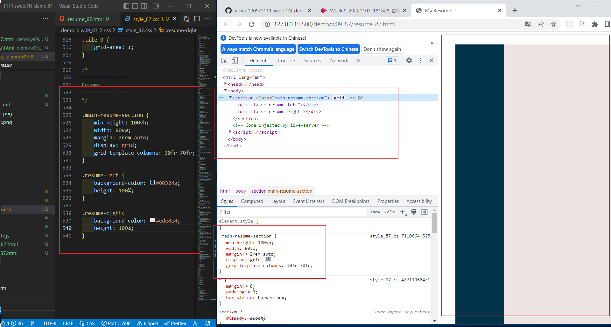
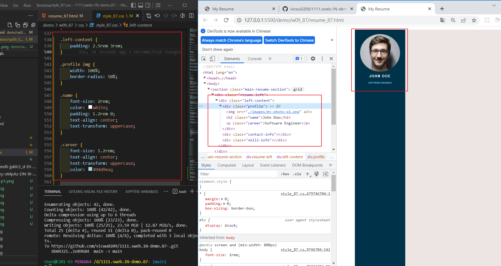
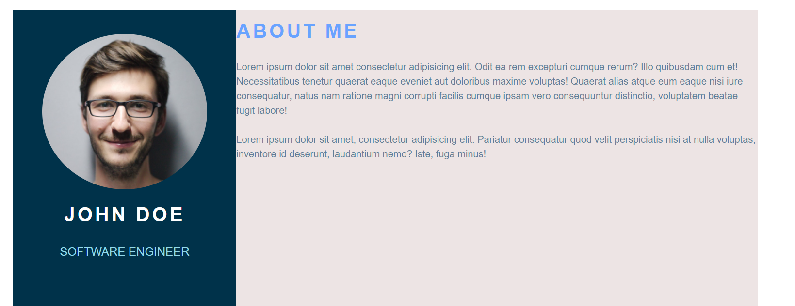
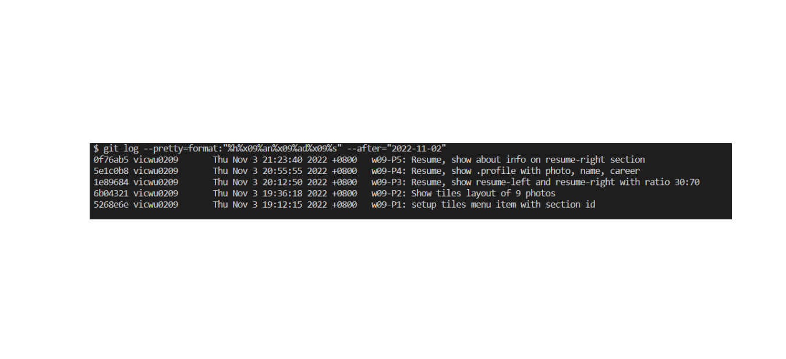

### Github repo url

[My Github repo](https://github.com/vicwu0209/1111.sweb.1N-demo.87-.git)

### w09-P1: setup tiles menu item with section id

### w09-P2: Show tiles layout of 9 photos

### w09-P3: Resume, show resume-left and resume-right with ratio 30:70

### w09-P4: Resume, show .profile with photo, name, career

### w09-P5: Resume, show about info on resume-right section

### w09-logs: w09 logs

$ git log --pretty=format:"%h%x09%an%x09%ad%x09%s" --after="2022-11-02"
0f76ab5 vicwu0209 Thu Nov 3 21:23:40 2022 +0800 w09-P5: Resume, show about info on resume-right section
5e1c0b8 vicwu0209 Thu Nov 3 20:55:55 2022 +0800 w09-P4: Resume, show .profile with photo, name, career
1e89684 vicwu0209 Thu Nov 3 20:12:50 2022 +0800 w09-P3: Resume, show resume-left and resume-right with ratio 30:70
6b04321 vicwu0209 Thu Nov 3 19:36:18 2022 +0800 w09-P2: Show tiles layout of 9 photos
5268e6e vicwu0209 Thu Nov 3 19:12:15 2022 +0800 w09-P1: setup tiles menu item with section id
