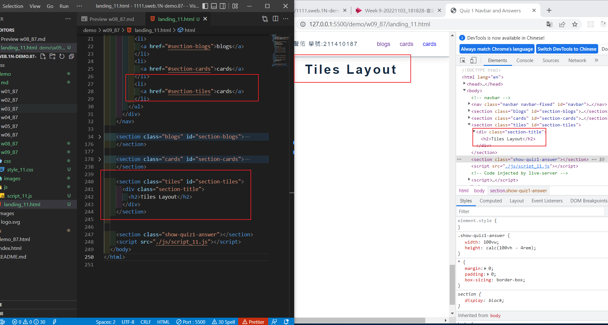

### Github repo url

[My Github repo](https://github.com/vicwu0209/1111.sweb.1N-demo.87-.git)

### w09-P1: setup tiles menu item with section id

### w09-P2: Show tiles layout of 9 photos

### W08-logs: W8 all logs

$ git log --pretty=format:"%h%x09%an%x09%ad%x09%s" --after="2022-10-26"
0636001 tutelary1105 Thu Oct 27 21:41:37 2022 +0800 W08-P3: define css variables for .btn-1, .btn-2, .btn-3
e1c2747 tutelary1105 Thu Oct 27 20:32:56 2022 +0800 W08-P2: fixed navbar setup and two sections with two links
7a57c4b tutelary1105 Thu Oct 27 19:04:42 2022 +0800 W08-P1: navbar with card1 and card2
