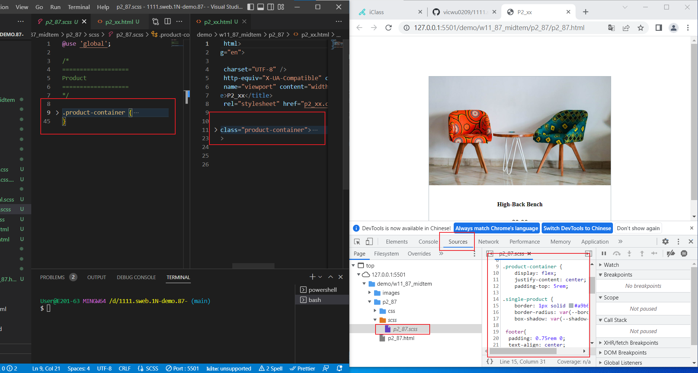
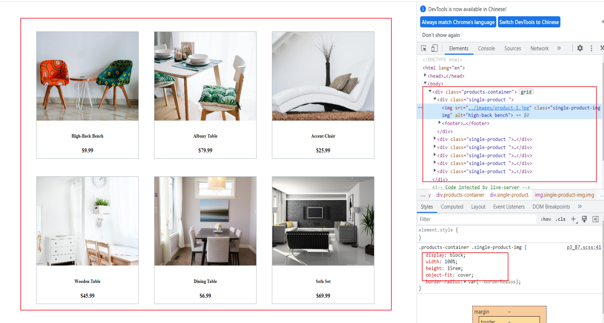

### Github repo url

[My Github repo](https://github.com/vicwu0209/1111.sweb.1N-demo.87-.git)

### W11-P1: answer of p1_xx using scss

### W11-P1: answer of p2_xx using scss

### w09-logs: w09 logs

$ git log --pretty=format:"%h%x09%an%x09%ad%x09%s" --after="2022-11-02"
