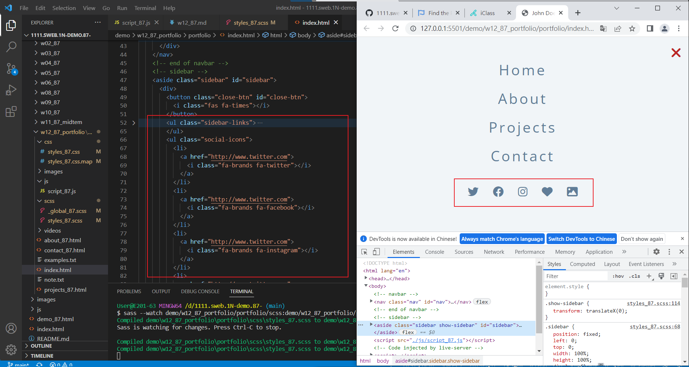
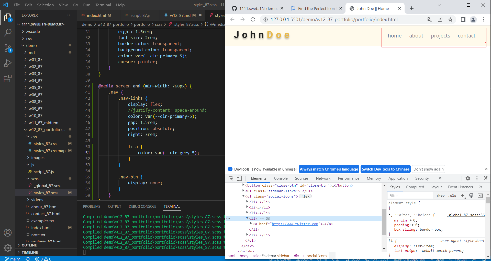

### Github repo url

[My Github repo](https://github.com/vicwu0209/1111.sweb.1N-demo.87-.git)

### W12-P1: click nav-btn, add show-sidebar; click close-btn, remove show-sidebar


### W12-P2: finish sidebar with social icons



### W12-P3: 判斷螢幕大小，顯示正確的 nav




### w11-logs: w09 logs


```
$ git log --pretty=format:"%h%x09%an%x09%ad%x09%s" --after="2022-11-02"
```