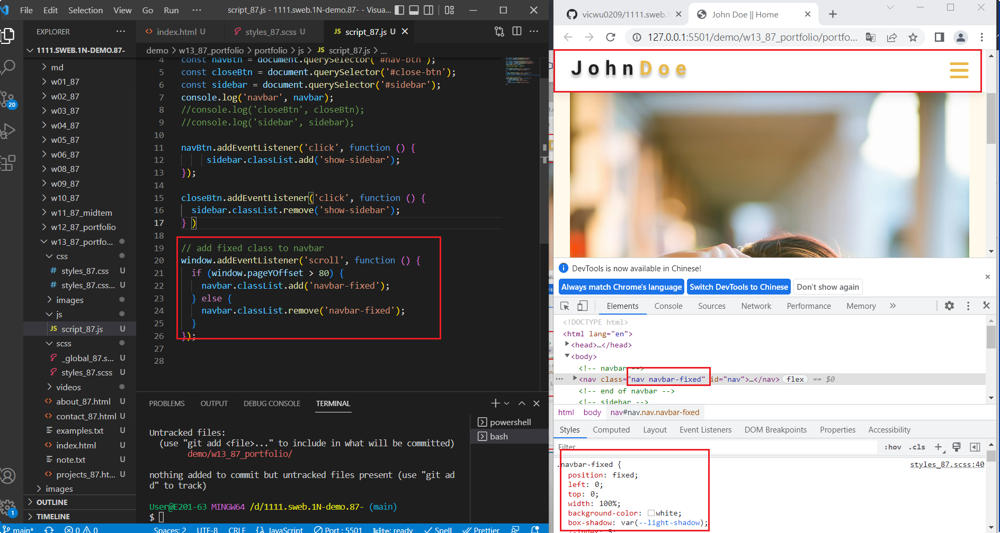
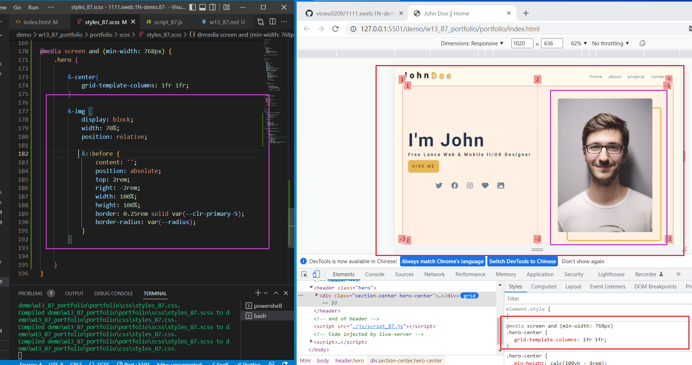

### Github repo url

[My Github repo](https://github.com/vicwu0209/1111.sweb.1N-demo.87-.git)

### W13-P1: show fixed navbar



### W13-P2: show photo in Hero section




### W12-P5: git log

[](w12-p5.png)

```
$ git log --pretty=format:"%h%x09%an%x09%ad%x09%s" --after="2022-11-23"
76ad7df vicwu0209       Thu Nov 24 23:33:17 2022 +0800  W12-P4: 完成 Hero HTML
0407dcc asd885151@gmial.com     Thu Nov 24 21:23:10 2022 +0800  W12-P2: finish sidebar with social icons
b6ec397 asd885151@gmial.com     Thu Nov 24 21:06:52 2022 +0800  W12-P3: 判斷螢幕大小，顯示正確的 nav
e09a36e asd885151@gmial.com     Thu Nov 24 19:48:31 2022 +0800  W12-P1: click nav-btn, add show-sidebar; click close-btn, remove show-sidebar
```
