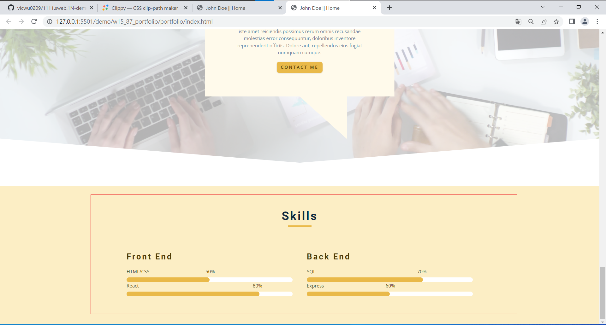
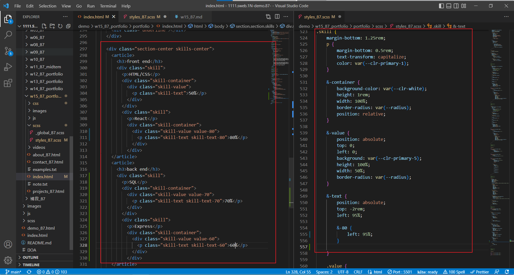
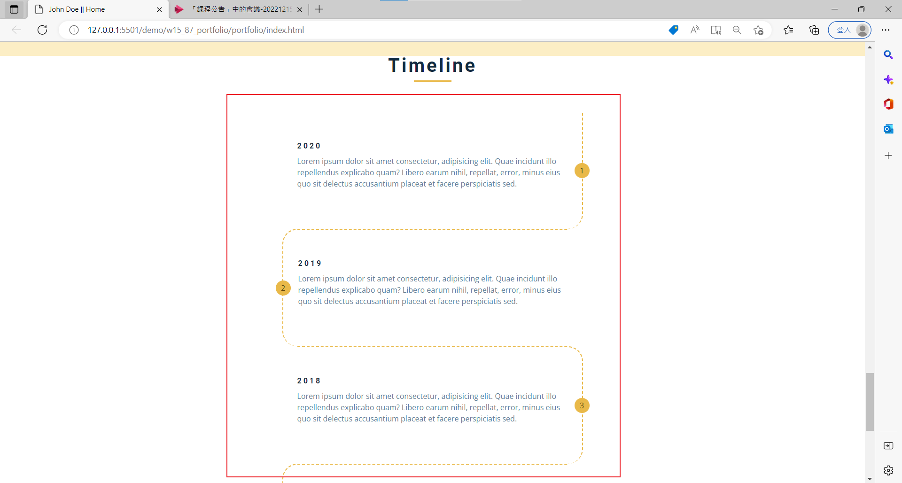
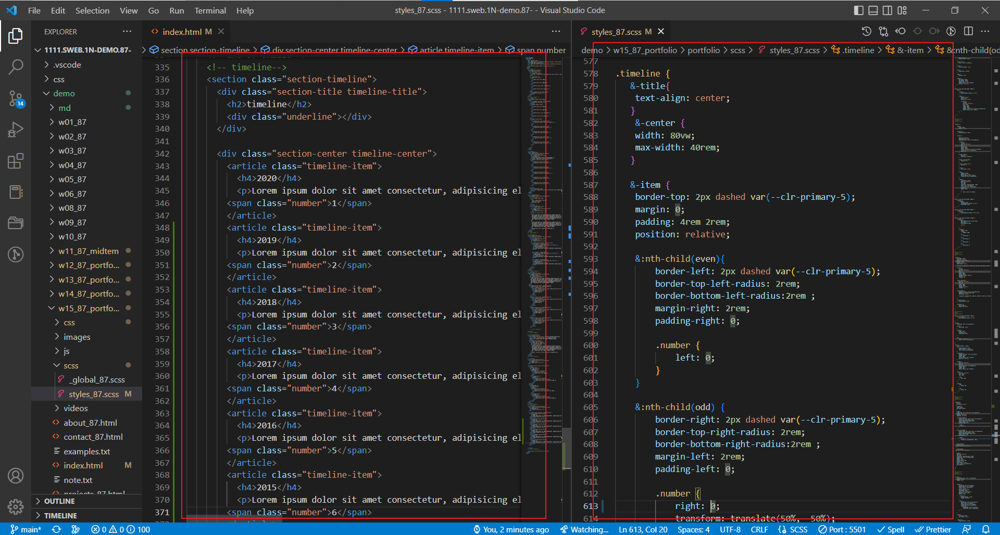
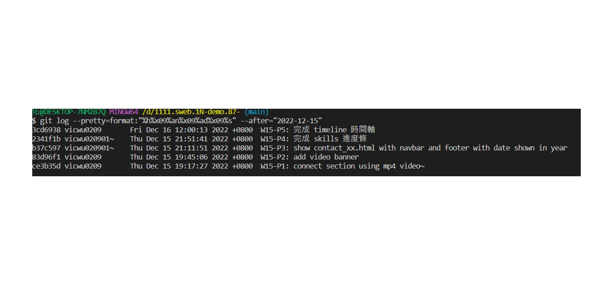

### Github repo url

[My Github repo](https://github.com/vicwu0209/1111.sweb.1N-demo.87-.git)

### W15-P1: connect section using mp4 video
 


### W15-P2: add video banner
 


### W15-P3: show contact_xx.html with navbar and footer with date shown in year


### W15-P4: 完成 skills 進度條
 




### W15-P5: 完成 timeline 時間軸



### W15-P6: git log



```
$ git log --pretty=format:"%h%x09%an%x09%ad%x09%s" --after="2022-12-15"
cd6938 vicwu0209       Fri Dec 16 12:00:13 2022 +0800  W15-P5: 完成 timeline 時間軸
2341f1b vicwu020901~    Thu Dec 15 21:51:41 2022 +0800  W15-P4: 完成 skills 進度條
b37c597 vicwu020901~    Thu Dec 15 21:11:51 2022 +0800  W15-P3: show contact_xx.html with navbar and footer with date shown in year
83d96f1 vicwu0209       Thu Dec 15 19:45:06 2022 +0800  W15-P2: add video banner
ce3b35d vicwu0209       Thu Dec 15 19:17:27 2022 +0800  W15-P1: connect section using mp4 video~

```
