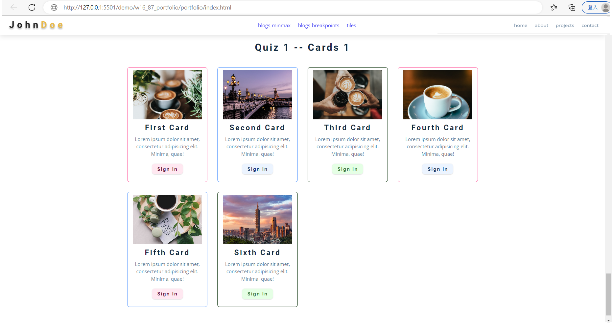

### Github repo url

[My Github repo](https://github.com/vicwu0209/1111.sweb.1N-demo.87-.git)

### W16-P1: add w6 blogs data into index.html as blogs section
 

 

### W16-P2: add w8 section-tiles-laytout to project_xx.html
 


### W16-P3: git log

```
$ git log --pretty=format:"%h%x09%an%x09%ad%x09%s" --after="2022-12-21"
git log --pretty=format:"%h%x09%an%x09%ad%x09%s" --after="2022-12-21"
26f83ee vicwu0209       Thu Dec 22 22:27:25 2022 +0800  W16-P2: add w8 section-tiles-laytout to project_xx.html
5d3c9d9 vicwu0209       Thu Dec 22 20:17:39 2022 +0800  W16-P1: add w6 blogs data into index.html as blogs section
```
